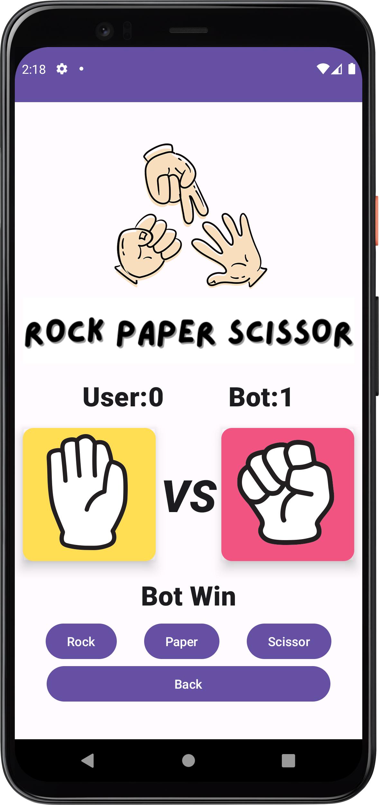

<!DOCTYPE html>
<html lang="en">
<head>
    <title>Rock Paper Scissors Game</title>
</head>
<body>
    <h1>Rock Paper Scissors Game</h1>
    <h2>Introduction</h2>
    

        The Rock Paper Scissors Game is an interactive Android application where users can play the classic game of Rock Paper Scissors against their device. This app is designed to be simple and fun, providing a quick and engaging experience for users of all ages.
    

    <h2>Features</h2>
    <ul>
        <li><strong>User Interface</strong>: Clean and user-friendly interface designed for Android devices.</li>
        <li><strong>Gameplay</strong>: Play Rock, Paper, Scissors against the device with randomized moves.</li>
        <li><strong>Score Tracking</strong>: Keeps track of the player's and the device's scores.</li>
        <li><strong>Responsive Design</strong>: Optimized for both phones and tablets.</li>
    </ul>
    <h2>Usage</h2>
    
To play the Rock Paper Scissors Game:

    <ol>
        <li>Open the app on your Android device.</li>
        <li>Select your move (Rock, Paper, or Scissors) by tapping the corresponding button.</li>
        <li>The device will make its move, and the result will be displayed.</li>
        <li>The scores will be updated accordingly.</li>
    </ol>
  <h2>Application Perview </h2>
    
Perview Screen of Rock Paper Scissors Game:

    <ul>
        <li><h3>Start Screen<h3> 
        
        </li>
        <li><h3>Play Screen </h3>
        
        </li>
        <li><h3>Result Screen </h3>
          
        </li>
    </ol>
    <h2>Contact</h2>
    
If you have any questions or need further assistance, please contact <strong>Akash Navik</strong> at <a href="akashnavik05@gmail.com">@email</a>.
      Do CheckOut My Linked Profile <a href ="https://www.linkedin.com/in/akash-navik-38007617a/">Akash Navik</a>
    

</body>
</html>
